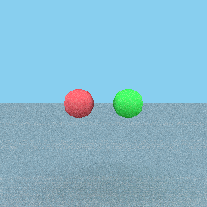
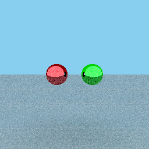
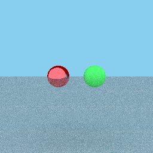
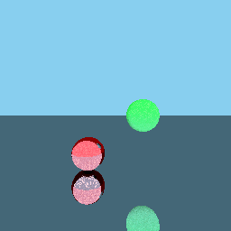
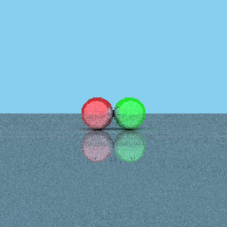

# raycasting
I went with a different approach to this model, which yielded similar results.

Instead of doing Phong-lighting directly, I propagated rays more traditionally.
The reason behind this was because I was not entirely sure how to determine the direction to the light source?
But the results that I got were similar to phong reflection, if a lot more pixelated.

A lot of the implementation for this algorithm came from [this video](https://www.youtube.com/watch?v=Qz0KTGYJtUk),
which I highly recommend passing on to the next generation of Computer Graphic Algorithm students.

Some choice results from my algorithm:

Two orbs with only diffuse bouncing:

Two orbs with only specular bouncing:

Two orbs, one that is reflective and one that isn't:

Two orbs, one reflective, on a mirror plane

Three mirrors all touching

Thank you so much, Professor Ribeiro, for this class. I found it deeply interesting, and enjoyed the work I did for this class.
I have learned so much about topics I wasn't aware existed before, and was able to explore them first hand.
This class was amazing, and I can tell that the future classes will enjoy an even more refined version.

All the best, Autumn Monsees